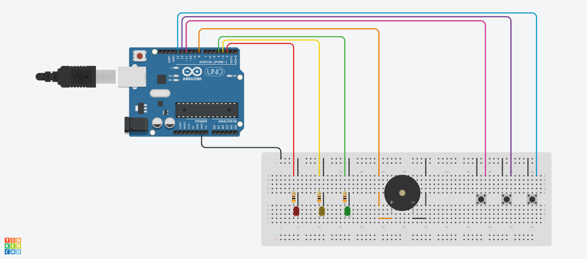
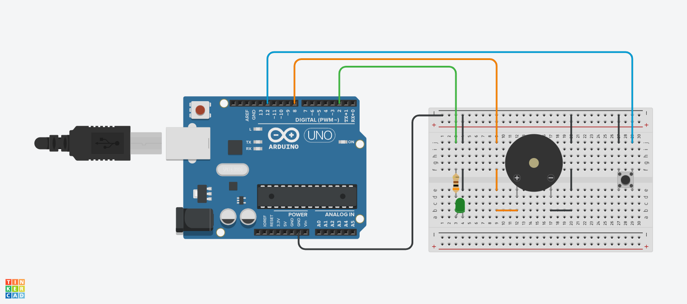
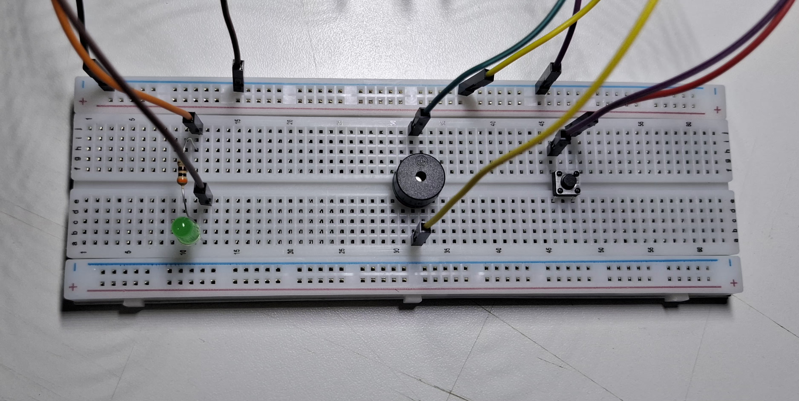

# Protótipo de Piano

Este projeto é dividido em duas partes. A primeira fase, tem como objetivo simular o funcionamento de um piano, integrando o uso de um buzzer, LEDs e botões. Já a segunda parte foi programada de modo que o buzzer possa reproduzir a canção Asa Branca de Luiz Gonzaga. 

  
 

O piano foi construído em conjunto com LEDs que acendem de acordo com o botão pressionado. Além disso, a nota musical atrelado a cada botão pode ser modificado conforme desejado. 

 

A canção Asa Branca foi prototipada com o uso do buzzer e de um LED que acende conforme a música é tocada. Tanto as notas usadas como os tempos musicais estão armazenados em vetores que são implementados no código para produzir o ritmo e a harmonia da canção. 

---
# Montagem - Piano

## Componentes utilizados
  - Arduino Uno (1x)
  - LED Verde 5 mm (1x)
  - LED Vermelho 5 mm (1x)
  - LED Amarelo 5 mm (1x)
  - Resistor 300 Ω (3x)
  - Buzzer Passivo 5 V (1x)
  - Chave Momentânea (PushButton) (3x)
  - Protoboard (1x)
  - Jumpers

---
## Esquemático do Circuito

  

 

**Legenda:**
  - D2 -> LED Vermelho
  - D3 -> LED Amarelo
  - D4 -> LED Verde
  - D8 -> Buzzer (+)
  - D11 -> Botão 01
  - D12 -> Botão 02
  - D13 -> Botão 03
  - Resistores: 300 Ω

---
## Montagem e Funcionamento

  

 

🎥 **Vídeo do Funcionamento:**  
👉 [Acesse clicando aqui!](https://youtu.be/SsBZyAJXiDw)

---
## Código do Projeto
Quer ver como esse projeto foi programado?  
👉 [Acesse o código clicando aqui!](piano/piano.ino)

---
# Montagem - Asa Branca

## Componentes utilizados
  - Arduino Uno (1x)
  - LED Verde 5 mm (1x)
  - Resistor 300 Ω (1x)
  - Buzzer Passivo 5 V (1x)
  - Chave Momentânea (PushButton) (1x)
  - Protoboard (1x)
  - Jumpers

---
## Esquemático do Circuito

  

 

**Legenda:**
  - D2 -> LED Verde
  - D8 -> Buzzer (+)
  - D12 -> Botão
  - Resistor: 300 Ω

---
## Montagem e Funcionamento

  

 

🎥 **Vídeo do Funcionamento:**  
👉 [Acesse clicando aqui!](https://youtu.be/SsBZyAJXiDw)

---
## Código do Projeto
Quer ver como esse projeto foi programado?  
👉 [Acesse o código clicando aqui!](asa-branca/asa-branca.ino)
